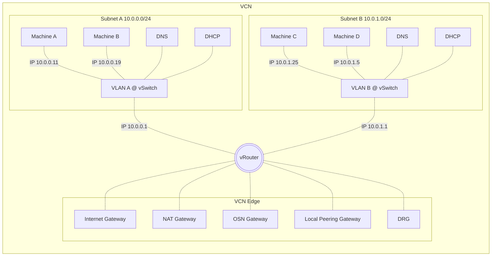

```mermaid
graph LR
    subgraph VCN
        subgraph Subnet A 10.0.0.0/24
            SA_1[Machine A]
            SA_2[Machine B]
            SA_DNS[DNS]
            SA_DHCP[DHCP]
            SA_L3[VLAN A @ vSwitch]
        end

        subgraph Subnet B 10.0.1.0/24
            SB_1[Machine C]
            SB_2[Machine D]
            SB_DNS[DNS]
            SB_DHCP[DHCP]
            SB_L3[VLAN B @ vSwitch]
        end

        R(((vRouter)))

        subgraph VCN Edge
            IGW[Internet Gateway]
            NAT[NAT Gateway]
            OSN[OSN Gateway]
            LPG[Local Peering Gateway]
            vDRG[DRG]
        end
    end

    SA_1 -.- |IP 10.0.0.11| SA_L3 
    SA_2 -.- |IP 10.0.0.19| SA_L3 
    SA_L3 -.- |IP 10.0.0.1| R 
    SA_DNS -.- SA_L3 
    SA_DHCP -.- SA_L3 


    SB_1 -.- |IP 10.0.1.25| SB_L3 
    SB_2 -.- |IP 10.0.1.5| SB_L3 
    SB_L3 -.- |IP 10.0.1.1| R 
    SB_DNS -.- SB_L3 
    SB_DHCP -.- SB_L3 

    R -.- IGW
    R -.- NAT
    R -.- OSN
    R -.- LPG
    R -.- vDRG
```