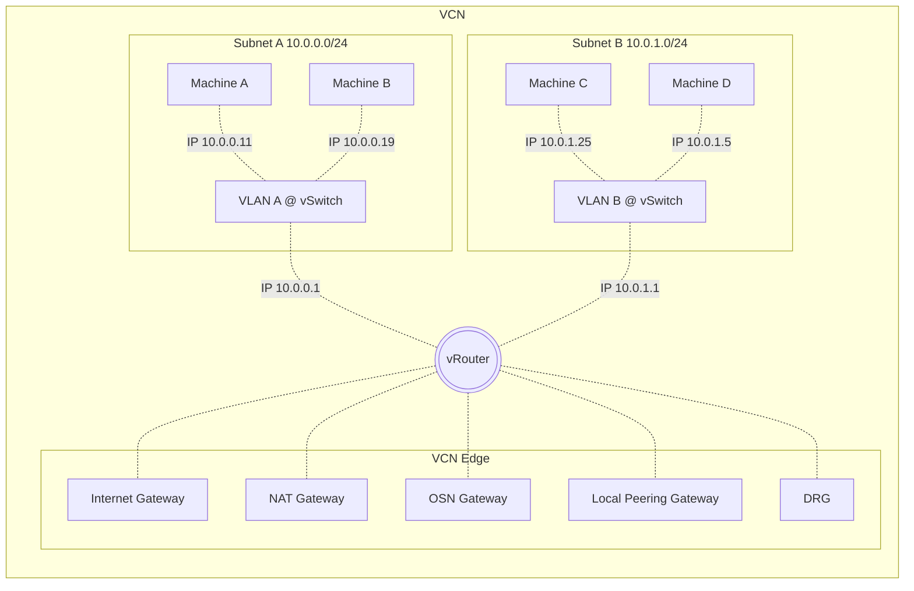
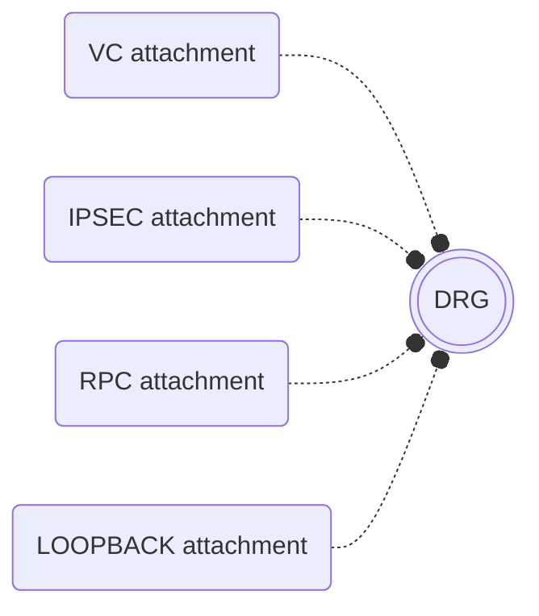
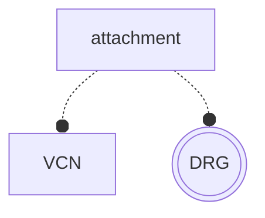
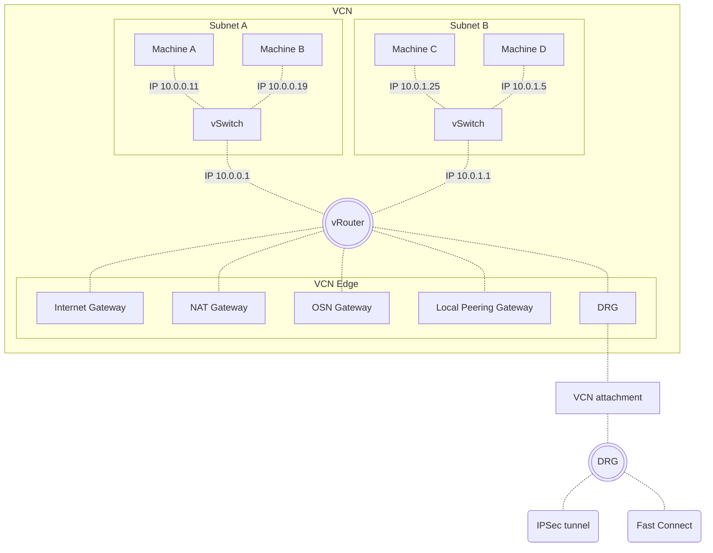

# OCI Routing
OCI virtual networking comes with virtual network elements as routers and routing facilitators. While routing can be a complex subject, OCI engineering has simplified much of this complexity for users, hiding all the complexity from our eyes. 

Network engineers with on-premises experience see each single element of the network starting from sockets, plugs, cables, switches, patch cords, routers, WAN interfaces, protocols, buffers, compressions, serial configuration ports and many, many more. All of this is virtualized in the OCI, what is a great achievement of the Cloud age. It's great but may lead to difficulties in understanding how this virtualized model works.

Originally, VCN routing was easy to understand and worked almost out of the box. However, things became more complicated around 2022 when OCI was extended with support for firewall appliances. This change introduced some areas of ambiguity in OCI virtual networking, making it more challenging to understand. I'll try to clarify these and turn the fog into the light.

## Rules
OCI virtual networking introduces a fundamental rule for making routing decisions on data packets received on an interface. This is a crucial concept to remember. 

> [!NOTE]
> Network engineers can explain this using VRF labels, which are associated with interfaces, or policy based routing.

## Interfaces
Each router has interfaces, however we do not see any interfaces in OCI apart of a virtual network interface (VNIC), attached to a compute instance. We see gateways in a virtual cloud network (VCN), and attachments in a distributed routing gateway (DRG). OCI engineering introduced router abstraction, to simplify complex things, but al the interfaces are in place, and it's critical to take them into consideration. I'll show them tyo you, what will make the routing clear and straight forward.

## Virtual Cloud Network
When you look closer to the VCN you understand that it's a virtualized segment of the network with all you need. There is a subnet, DNS, DHCP, firewall, and a router. 

> [!NOTE]
> Network engineer sees layer-3 switch in the VCN with VLANs which are most probably implemented using Open vSwitch technology.

Other elements are exposed but the router is completely hidden from our eyes with only route tables exposed to the operator. As we know the routing table may be associated with subnet, and OCI documentation says that this route is applied on data leaving the subnet. What? Leaving the subnet? It's in opposition to the rule that routing decision is made on ingress data. In fact no. All is associated with ingress data.

You just need to find the hidden router in a VCN and answer the question how this router interacts with subnets and gateways. To make is easier let me remind you that each subnet comes with IP address which is used by each device as default router. It means that each subnet comes with interface, as IP address is an interface property.

And here is the answer: routing decision is made on data packet leaving the subnet, what means that it's an ingress packet for subnet's gateway interface exposed by VCN internal router.

To build the bigger picture I'll say that each virtual network interface (VNIC) is connected to virtual switch which is connected to the router's interface configured with subnet's gateway IP address. As we know each OCI subnet comes with default gateway at first available host IP address.

Having this magic picture of the VCN, you see now what does it mean when OCI blogs and documentation says that "traffic leaves the subnet". In fact this traffic enters VCN router's interface, where routing decision is being made.

## Longest Prefix Match
Classic routers make routing decisions using a list of routes defined as CIDR next-hop pairs. The problem is that multiple routes may match the destination address. This issue is resolved by choosing the route with the most specific (longest) prefix. For example, a route with a /32 prefix will always be chosen over a /24 prefix, and a /24 prefix will always be chosen over a /16 prefix, etc.

> [!NOTE]
> Longest Prefix Match (LPM) is applied at all OCI routers, however internal VCN router behaves in a different way due to intra-VCN routing.

## Intra-VCN routing
Intra-VCN routing is one of elements added during introduction of support for private firewall appliances. VCN router accepts static routes with Subnet CIDR to route them trough Private IP. That's ok as router builds actual route table out of static and internal routes, and static ones are always preferred. Network engineer will say that administrative distance of static routes is lower. 

The issue is that OCI permits you to enter static route with VCN CIDR which is an IP address space for the whole virtual cloud network, which by definition is less specific than any VCN's subnet's CIDR. Such route should be ignored by longest prefix match selection making local route effective. This behavior obviously brakes LPM, but is highly useful and it's an interesting idea, as this simple rule routes all potential traffic to any subnet within the VCN to a firewall appliance. 

> [!NOTE]
> OCI VCN internal router breaks LPM rules selecting route with VCN CIDR over Subnets' internal routes.

## Dynamic Routing Gateway

DRG is a regular element of OCI network, providing connectivity between VCNs and other systems over Ethernet and IPSec. Engineers working with OCI from early years, remember initial DRG version supporting only remote peering, Fast Connect, and IPSec with hardcoded routing. DRG was drastically changed in 2021 when OCI included support for transit routing / private firewall alliances.

Upgraded DRG provides enhanced routing support incl. virtualized BGP. Now you can see advertised routes, and control the advertisements. Core network engineer will be unhappy with lack of typical BGP console, but OCI always visualizes low level services, and the same happened to BGP, providing required information. This article will not discuss BGP any deeper, focusing on core routing. 

### DRG attachments

DRG routes are different objects than VCN ones, what is even visible in naming convention. VCN talks about target type and identifier, but DRG routes to "attachments". Before going further we need to understand what the attachment is?  

I'd like to put here simple answer that the attachment is an interface of certain type. It's a correct answer for majority of destinations, where only one route table may be specified. Following diagram presents DRG attachments with one ingress route table.

There is a problem with VCN attachments, as this one takes two route tables. The first one is regular DRG side ingres route table, and the other one is a VCN route table. Here we have both ingress and egress traffic, and it's difficult to apply "traffic leaving the subnet" rule. 

DRG introduces new type of the route table - VCN route tables. 

Having above attachment model, we can easily apply "interface ingress" rule, as we see that the attachment is in fact a virtual cable connecting two network interfaces - one plugged into a VCN router, and the other one plugged into the DRG virtual device. The rule of ingress routing can be easily applied when we see VCN internal router, which process VCN side route table for ingress data received on DRG interface. The sam applies to DRG on data received on VCN interface, when ingress route tale rules are used.

## Complete model

Let's take a look at diagram showing VCN and DRG inter-connectivity. Keep in mind that routing decision is always made by a router on receiving interface for ingress data.

Having above diagram at your eyes with hidden vSwitch and vRouter inside of the VCN you will always understand in a clear way how data flows, and how routing decisions are made. 

Few more secrets are still required to be unveiled, to fully understand what happens inside of the VCN's routing decisions.

# Summary

OCI routing is implemented following industry standard rules with exception of VCN CIDR route at VCN router. To understand the routing it's mandatory to remember about hidden VCN router and a subnet as group of hidden switch pots connected by switch virtual interface (SVI). Awareness of VCN router's hidden interfaces enables use of one simple rule that "route table is applied on interface's ingress traffic". The same applies to gateways route tables, which are associated with VCN router's gateway interface, and to DRG attachments.